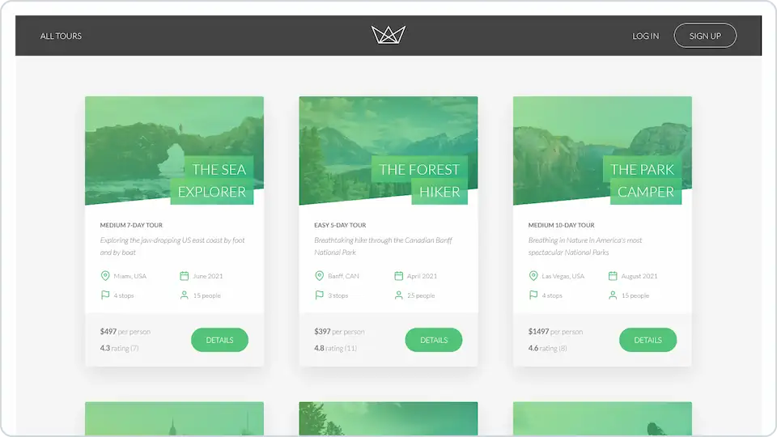

# 

**Web application for a fictional company that offers tours in nature.**

## 💻 Screenshots

## 🛠️ Tools and technologies
`Node.js` `Express` `RESTful API` `MongoDB` `Mongoose` `Pug` `HTML` `CSS` `npm` `axios` `bcryptjs` `sharp` `jsonwebtoken`

Functionalities:
- Logging in
- Resetting a password
- Displaying tours
- Sorting tours
- Adding and deleting tours
- Authentication and authorization

## 🎓 Related course
This project was created as a part of the [Udemy](https://www.udemy.com/ 'Udemy') course [_Node.js, Express, MongoDB & More: The Complete Bootcamp 2023_](https://www.udemy.com/course/nodejs-express-mongodb-bootcamp/ 'See this course on Udemy') by [Jonas Schmedtmann](https://twitter.com/jonasschmedtman 'Jonas Schmedtmann on Twitter').
